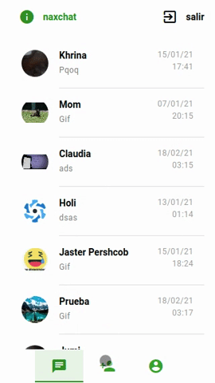

# NaxChatApp

Aplicación de chat de código multiplataforma (ios, android, windows, pwa). El diseño es para móvil.



### Funcionalidades

* Enviar Chats con codificación para privacidad (solo puedes leer los mensajes dentro de la App).
* Mandar gifs a través de la api GIPHY Developers.
* Subir fotos de galería o cámara desde tu smartphone.
* Notificaciones push en 2do plano desde service worker con api alojada en heroku con nodeJs y fcm send.
* Lista de amigos agregados y solicitudes.
* Imágenes redimensionadas a menor tamaño con librería ES6 de Js a tamaño thumbnails.
* Mandar, recibir y borrar solicitudes de amistar con Email o Id de usuario.

### Pwa

[Demo online](https://asdf-3e590.web.app/) | [Descargar](./dist/Pwa/)

### Android

[Capacitor](./dist/Android/naxChat_Capacitor_1.4.apk) | [Cordova ](./dist/Android/naxChat_Cordova_1.36.apk)

### Pre-requisitos 📋

* [NodeJs](https://nodejs.org/es/)
* [Quasar](https://quasar.dev/quasar-cli/installation)

### Instalación 🔧

Posterior a instalar quasar ejecute en la consola
```
quasar create carpeta
```

## Desarrollo 📦


```shell
cd carpeta
quasar dev
```
No olvides configurar tu proyecto de firebase en boot/firebase.js (Puedes poner la configuración en otra parte, yo la puse ahí)

## Producción

Pwa
```
quasar build -m pwa
```
El codigo compilado se ubica en ./dist

Deploy móvil
```
quasar build -m [capacitor|cordova] -T [android|ios]
```

Deploy se ubica en la carpeta dist/capacitor

Electron (.exe)
```
quasar build -m electron
```

### Herramientas usadas

* VueJs (2 y 3)
* Quasar (1 y 2)
* Vuex (3 y 4)
* Firebase 8.9
* Javascript ES6+
* NodeJs 14
* Apis Rest (gyphy dev, fcm send, api propia con nodeJs)
* Service workers (notis push 2do plano)

## Github 📌

Uso [GIT](https://git-scm.com/) para control de versiones.
Puedes ver los comandos que uso [aqui](https://nacholabraweb.000webhostapp.com/Tutoriales#/Github)

Agradecimientos a github por tener este proyecto en la nube.

## Licencia 📄

Este proyecto está bajo la Licencia (MIT)

App desarrollada por Ignacio Labra


